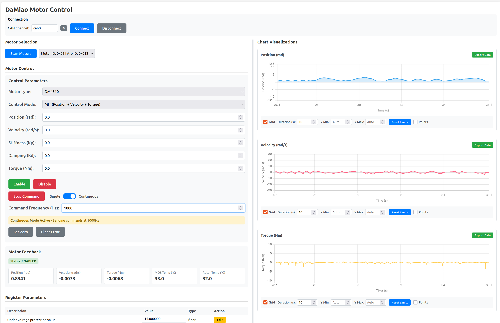

# damiao-motor


[](https://pypi.org/project/damiao-motor/)

Python driver for **DaMiao** brushless motors over CAN. Control one or more motors on a single bus, with a unified CLI, web GUI, and library API.

- **Control modes:** MIT, POS_VEL, VEL, FORCE_POS  
- **Motor types:** DM3507, DM4310, DM4340, DM6006, DM8006, DM8009, DM10010/L, and more  
- **Tools:** `damiao` CLI (scan, send-cmd, set-zero-command, set-motor-id, etc.) and `damiao-gui` web interface  

**Docs:** [GitHub Pages](https://jia-xie.github.io/python-damiao-driver/) · **Firmware:** [DaMiao motor firmware (Gitee)](https://gitee.com/kit-miao/motor-firmware)

---

## Installation

```bash
pip install damiao-motor
```

**Requirements:** Linux, CAN interface (e.g. socketcan on `can0`). Bring the interface up and set bitrate to match the motor (e.g. 1 Mbps) before use.

---

## Quick start

**Safety:** Examples move the motor. Mount it securely and keep clear of moving parts.

```bash
python examples/example.py
```

Edit `examples/example.py` to set `motor_id`, `feedback_id`, `motor_type`, and `channel` for your hardware.

### Minimal code

```python
from damiao_motor import DaMiaoController

controller = DaMiaoController(channel="can0", bustype="socketcan")
motor = controller.add_motor(motor_id=0x01, feedback_id=0x00, motor_type="DM4340")

controller.enable_all()
motor.ensure_control_mode("MIT")  # required before send_cmd in MIT mode

motor.send_cmd(target_position=1.0, target_velocity=0.0, stiffness=20.0, damping=0.5, feedforward_torque=0.0)
# ... controller polls feedback in background; use motor.get_states() to read

controller.shutdown()
```

---

## CLI: `damiao`

All `damiao` subcommands require `--motor-type` (e.g. `DM4340`). Use `damiao <cmd> --help` for options.

| Command | Description |
|---------|-------------|
| `damiao scan --motor-type DM4340` | Scan for motors on the bus |
| `damiao send-cmd --motor-type DM4340 --id 1 --mode MIT` | Send position/velocity/stiffness commands (MIT, POS_VEL, VEL, FORCE_POS) |
| `damiao set-zero-command --motor-type DM4340 --id 1` | Send zero command (hold at zero) |
| `damiao set-zero-position --motor-type DM4340 --id 1` | Set current position to zero |
| `damiao set-can-timeout --motor-type DM4340 --id 1 --timeout-ms 1000` | Set CAN timeout (register 9) |
| `damiao set-motor-id` / `damiao set-feedback-id` | Change motor or feedback ID (registers 8, 7) |

---

## Web GUI: `damiao-gui`

```bash
damiao-gui
```

Then open **http://127.0.0.1:5000**.



The interface provides:

- **Connection & Motor Selection** — CAN channel, Connect/Disconnect, Scan for motors, choose motor by ID  
- **Motor Control** — Motor type, control mode (MIT, POS_VEL, VEL, FORCE_POS), target position/velocity/stiffness/damping/torque, Enable/Disable, Stop, Single/Continuous command, Set Zero, Clear Error  
- **Motor Feedback** — Live status, position, velocity, torque, MOSFET and rotor temperature  
- **Register Parameters** — Table of all registers with edit for writable ones  
- **Charts** — Real-time position, velocity, and torque vs. time with zoom, export, and axis controls  

---

## Library API

- **`DaMiaoController(channel, bustype)`** — owns the CAN bus and background feedback polling.  
- **`controller.add_motor(motor_id, feedback_id, motor_type)`** — add a motor. `motor_type` is required (e.g. `"DM4340"`).  
- **`motor.ensure_control_mode(mode)`** — set register 10 to `"MIT"`, `"POS_VEL"`, `"VEL"`, or `"FORCE_POS"` before sending commands in that mode.  
- **`motor.send_cmd(...)`** — send target position, velocity, stiffness, damping, feedforward (MIT), or mode-specific commands.  
- **`motor.get_states()`** — last decoded feedback (pos, vel, torq, status, etc.).  
- **`motor.get_register` / `motor.write_register`** — read/write registers by ID.  

See the [API docs](https://jia-xie.github.io/python-damiao-driver/api/controller/) and [motor configuration](https://jia-xie.github.io/python-damiao-driver/configuration/motor-config/) for details.

---