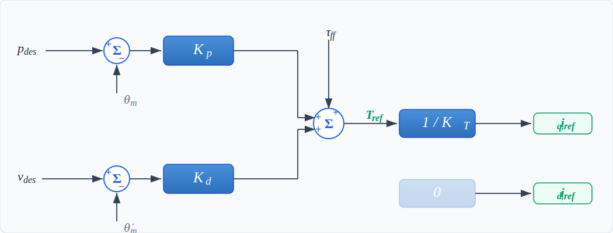
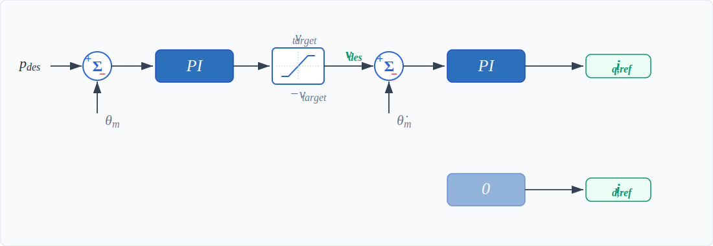
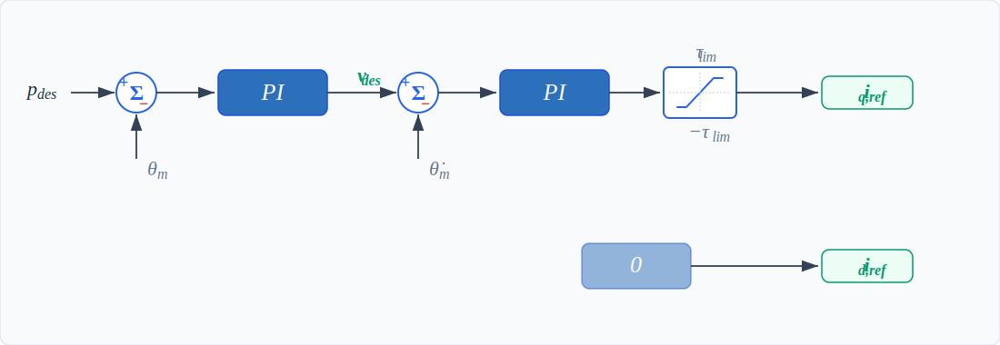

---
tags:
  - concept
  - control-modes
  - reference
---

# Motor Control Modes

DaMiao motors support four different control modes, each optimized for different use cases.

Quick links: [MIT mode](#mit-mode) | [POS_VEL mode](#pos-vel-mode) | [VEL mode](#vel-mode) | [FORCE_POS mode](#force-pos-mode)

!!! tip "Recommended learning path"
    To better understand the control modes in practice, use [`damiao gui`](../package-usage/web-gui.md) and switch between modes while observing live feedback and charts.

## Overview

Control modes determine how the motor interprets command messages. The control mode is set via [register 10 (CTRL_MODE)](registers.md) and must match the command format being sent.

API method: [`DaMiaoMotor.ensure_control_mode()`](../api/motor.md)

The `ensure_control_mode()` method automatically:

1. Reads the current mode from register 10

2. Writes the new mode if different

3. Verifies the write was successful

**Low Level Torque Control (Current-based)**

All four modes eventually do the same low-level job: they run a **current feedback loop** inside the motor controller.

In simple terms:

- The selected mode (MIT/POS_VEL/VEL/FORCE_POS) decides what current the motor should produce.

- That target current is sent to a fast inner controller.

- The inner controller continuously compares target current vs measured current and corrects PWM voltage to reduce the error.

- **$i_{q,\mathrm{ref}}$**: the target for the torque-producing current.
  Larger magnitude means stronger torque. Sign decides rotation direction.

- **$i_{d,\mathrm{ref}}$**: the target for the flux-axis current.
  In these modes it is set to `0`, meaning "do not add extra d-axis current."

!!! note "Note"
    The motor tracks the calculated $i_{q,\mathrm{ref}}$ to produce the desired torque, while keeping the d-axis current at $i_{d,\mathrm{ref}} = 0$.

| Mode | Easy interpretation of $i_{q,\mathrm{ref}}$ | $i_{d,\mathrm{ref}}$ |
|------|-------------------------------------|-------------|
| MIT | Calculated from position/velocity error + feedforward torque, then converted to current | `0` |
| POS_VEL | Position loop outputs a speed target, speed loop converts that speed error to current | `0` |
| VEL | Speed loop directly converts velocity error to current | `0` |
| FORCE_POS | Position loop and speed loop compute current, then it is clipped by current/force limit | `0` |

## MIT Mode (Impedance Control) {#mit-mode}

**MIT mode** (named after MIT's Cheetah robot) provides impedance control with position, velocity, stiffness, damping, and feedforward torque.

API method: [`DaMiaoMotor.send_cmd_mit()`](../api/motor.md)

| Parameter | Range | Description |
|-----------|-------|-------------|
| `target_position` | Motor-specific | Desired position (radians) |
| `target_velocity` | Motor-specific | Desired velocity (rad/s) |
| `stiffness` (kp) | 0-500 | Position gain (stiffness) |
| `damping` (kd) | 0-5 | Velocity gain (damping) |
| `feedforward_torque` | Motor-specific | Feedforward torque (Nm) |

$$
T_{\text{ref}} = K_p \cdot (p_{\text{des}} - \theta_m) + K_d \cdot (v_{\text{des}} - \dot{\theta}_m) + \tau_{ff}
$$

$$
i_{q,\text{ref}} = \frac{T_{\text{ref}}}{K_T}, \quad i_{d,\text{ref}} = 0
$$

## POS_VEL Mode (Position + Velocity-Limit) {#pos-vel-mode}

**POS_VEL mode** provides position-velocity control with trapezoidal motion profiles. The motor moves toward the target position, limiting velocity to the specified maximum, with automatic acceleration and deceleration.

API method: [`DaMiaoMotor.send_cmd_pos_vel()`](../api/motor.md)

| Parameter | Range | Description |
|-----------|-------|-------------|
| `target_position` | Motor-specific | Desired position (radians) |
| `velocity_limit` | Motor-specific | Maximum velocity during motion (rad/s) |

$$
v_{\text{des}} = \text{clip}\!\left(K_{p,\text{apr}} (p_{\text{des}} - \theta_m) + K_{i,\text{apr}} \int (p_{\text{des}} - \theta_m) \, dt,\; -v_{\text{limit}},\; v_{\text{limit}}\right)
$$

In the control-law diagram, `velocity_limit` directly sets the clip bounds \(\pm v_{\text{limit}}\).

$$
i_{q,\text{ref}} = K_{p,\text{asr}} (v_{\text{des}} - \dot{\theta}_m) + K_{i,\text{asr}} \int (v_{\text{des}} - \dot{\theta}_m) \, dt, \quad i_{d,\text{ref}} = 0
$$

where \(v_{\text{limit}}\) is the commanded `velocity_limit`, [KP_APR](registers.md) (reg 27), [KI_APR](registers.md) (reg 28) are position loop gains, and [KP_ASR](registers.md) (reg 25), [KI_ASR](registers.md) (reg 26) are speed loop gains.

## VEL Mode (Velocity) {#vel-mode}

**VEL mode** provides pure velocity control. The motor maintains the commanded velocity. Positive values rotate in one direction, negative values in the opposite direction.

API method: [`DaMiaoMotor.send_cmd_vel()`](../api/motor.md)

| Parameter | Range | Description |
|-----------|-------|-------------|
| `target_velocity` | Motor-specific | Desired velocity (rad/s) |

$$
i_{q,\text{ref}} = K_{p,\text{asr}} (v_{\text{des}} - \dot{\theta}_m) + K_{i,\text{asr}} \int (v_{\text{des}} - \dot{\theta}_m) \, dt, \quad i_{d,\text{ref}} = 0
$$

where [KP_ASR](registers.md) (reg 25) and [KI_ASR](registers.md) (reg 26) are speed loop gains.

## FORCE_POS Mode (Force-Limited Position) {#force-pos-mode}

**FORCE_POS mode** (Force-Position Hybrid) provides position control with velocity and torque-limit-ratio constraints. The motor moves toward the target position while respecting these limits, providing safe position control with force limiting.

API method: [`DaMiaoMotor.send_cmd_force_pos()`](../api/motor.md)

| Parameter | Range | Description |
|-----------|-------|-------------|
| `target_position` | Motor-specific | Desired position (radians) |
| `velocity_limit` | 0-100 rad/s | Maximum velocity during motion |
| `torque_limit_ratio` | 0.0-1.0 | Normalized torque-limit coefficient |

$$
v_{\text{des}} = \text{clip}\!\left(K_{p,\text{apr}} (p_{\text{des}} - \theta_m) + K_{i,\text{apr}} \int (p_{\text{des}} - \theta_m) \, dt,\; -v_{\text{limit}},\; v_{\text{limit}}\right)
$$

$$
i_{q,\text{ref}} = \text{clip}\!\left(K_{p,\text{asr}} (v_{\text{des}} - \dot{\theta}_m) + K_{i,\text{asr}} \int (v_{\text{des}} - \dot{\theta}_m) \, dt,\; -\tau_{\text{lim}},\; \tau_{\text{lim}}\right), \quad i_{d,\text{ref}} = 0
$$

In FORCE_POS mode:

$$
\tau_{\text{lim}} = \text{torque_limit_ratio} \cdot T_{\max}
$$

Here \(T_{\max}\) is the max torque for the selected motor type (for example, for `4340`, \(T_{\max}=28\) Nm, so `torque_limit_ratio=0.5` gives \(\tau_{\text{lim}}=14\) Nm).

Also, \(v_{\text{limit}}\) is the commanded `velocity_limit`, [KP_APR](registers.md) (reg 27), [KI_APR](registers.md) (reg 28) are position loop gains, and [KP_ASR](registers.md) (reg 25), [KI_ASR](registers.md) (reg 26) are speed loop gains.
