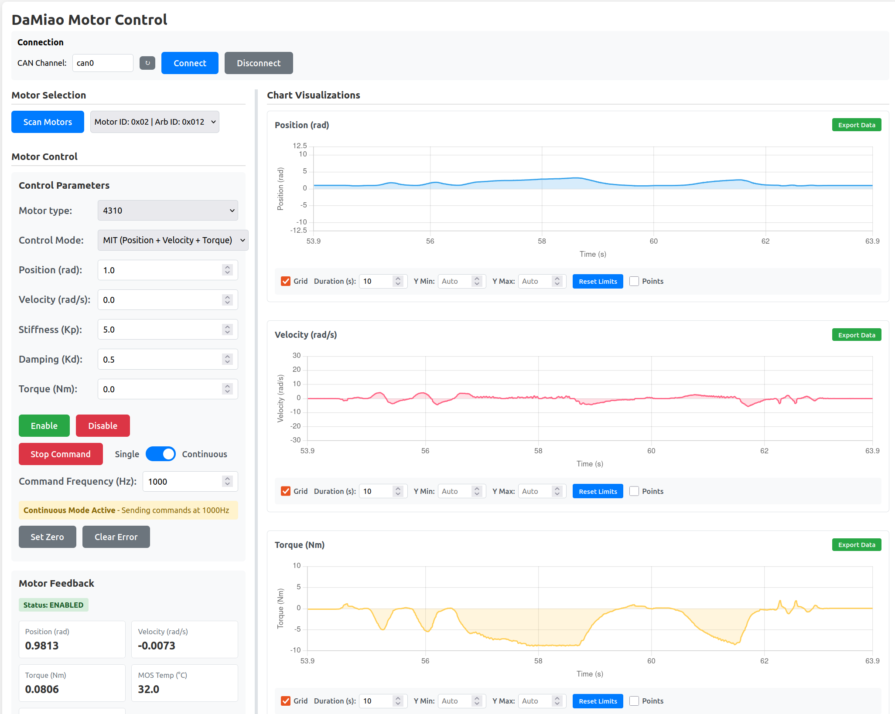

---
tags:
  - getting-started
  - overview
---

# DaMiao Motor


[](https://pypi.org/project/damiao-motor/)



!!! warning "Safety"
    Commands can move hardware immediately. Use a secure setup and keep clear of moving parts.

## What you can do

<div class="grid cards" markdown>

- **[CLI Tools](package-usage/cli-tool.md)**

  Use `damiao` commands to scan, command, and configure motors.

- **[Web GUI](package-usage/web-gui.md)**

  Monitor live position, velocity, torque, and edit writable registers.

- **[Python API](api/motor.md)**

  Build robust control loops and automate multi-motor workflows.

- **[Motor Control Modes](concept/motor-control-modes.md)**

  Understand [MIT](concept/motor-control-modes.md#mit-mode), [POS_VEL](concept/motor-control-modes.md#pos-vel-mode), [VEL](concept/motor-control-modes.md#vel-mode), and [FORCE_POS](concept/motor-control-modes.md#force-pos-mode) behavior in detail.

</div>

## Control laws preview


The [MIT mode](concept/motor-control-modes.md#mit-mode) combines position error, velocity error, and feedforward torque:

```text
T_ref  = Kp * (p_des - theta_m) + Kd * (v_des - dtheta_m) + tau_ff
iq_ref = T_ref / K_T
id_ref = 0
```

See all control law diagrams:

- [MIT mode](concept/motor-control-modes.md#mit-mode)
- [POS_VEL mode](concept/motor-control-modes.md#pos-vel-mode)
- [VEL mode](concept/motor-control-modes.md#vel-mode)
- [FORCE_POS mode](concept/motor-control-modes.md#force-pos-mode)

## Installation

### Install from PyPI

```bash
pip install damiao-motor
```

### Install from source

For latest repository updates:

```bash
git clone https://github.com/jia-xie/python-damiao-driver.git
cd python-damiao-driver
pip install -e .
```

### Verify Installation

```bash
python -c "import damiao_motor; print(damiao_motor.__version__)"
```

Then verify CLI availability:

```bash
damiao --help
```

## Next steps

- [Hardware Setup](hardware-setup/can-set-up.md) - CAN interface setup
- [Package Tools](package-usage/cli-tool.md) - Using the CLI tools
