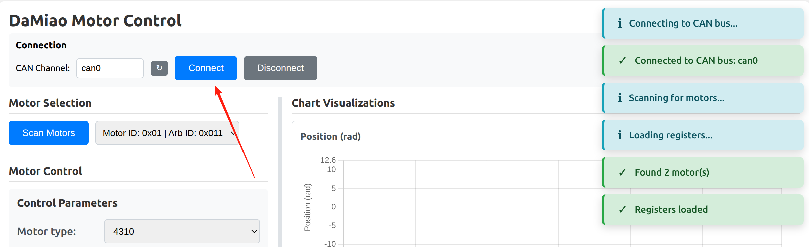
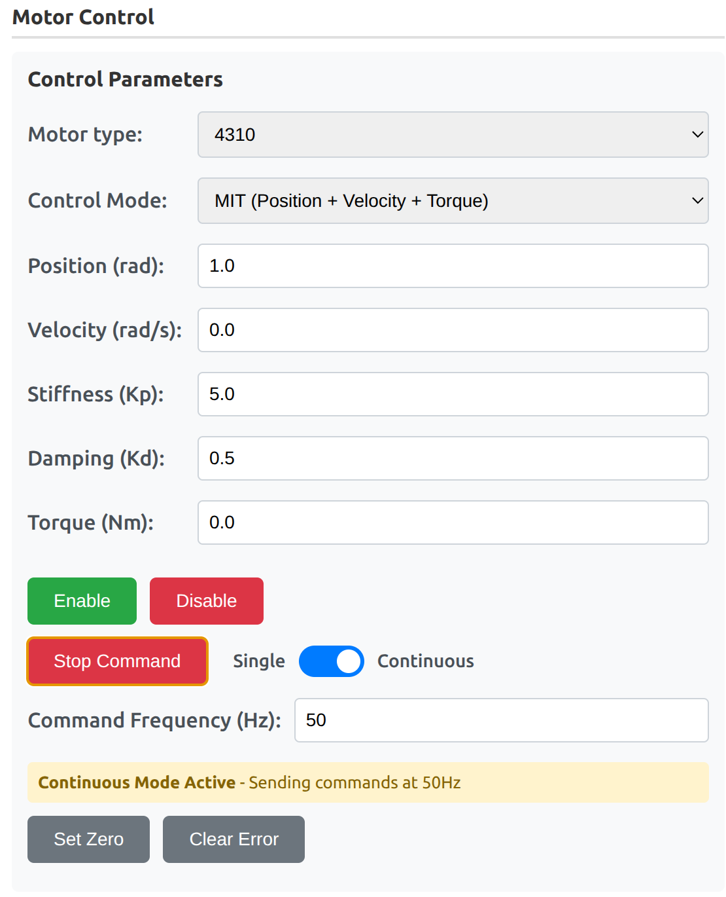

---
tags:
  - usage
  - gui
  - web
---

# Web GUI

The `damiao gui` command provides a web-based interface to connect to the CAN bus, scan for DaMiao motors, run commands, view and edit registers, and plot position, velocity, and torque in real time.


---

## Installation

Install the package; the `damiao` command will be available in your PATH:

```bash
pip install damiao-motor
```

## Starting the GUI

```bash
damiao gui
```

Open **http://127.0.0.1:5000** in your browser.

!!! tip "Recommended for control modes"
    To better understand [control modes](../concept/motor-control-modes.md), use `damiao gui` to switch between MIT/POS_VEL/VEL/FORCE_POS and observe parameter visibility and live charts.

### Command options

| Option | Description |
|--------|-------------|
| `--host` | Host (default: 127.0.0.1) |
| `--port` | Port (default: 5000) |
| `--debug` | Enable debug mode |
| `--production` | Use production server (requires `pip install waitress`) |

Examples:

```bash
damiao gui --port 8080
damiao gui --host 0.0.0.0
damiao gui --production
```

---

## Connection Bring-Up Workflow (GUI)

Use this workflow to validate setup and start controlling motors from the GUI.

### 1. Start the GUI

```bash
damiao gui
```

Open **http://127.0.0.1:5000** in your browser.

Interface layout:

- **Top bar**: Connection controls (CAN channel, Connect, Disconnect).
- **Left column**: Motor Selection, Motor Control, Register Parameters.
- **Right column**: Chart Visualizations (Position, Velocity, Torque).

### 2. Connect to CAN Interface

- Select CAN channel (`can0`, `vcan0`, etc.) and click **Connect**.
- If your interface is not listed, use the refresh button and select again.
- Confirm status log messages show successful connection (for example: *Connecting...*, then *Connected to CAN bus: can0*).
- Use **Disconnect** to safely reset connection and clear detected motors.

{ .doc-screenshot }

### 3. Scan and Select Motor

- Click **Scan Motors**.
- Select the target motor from the dropdown (`Motor ID: 0xXX | Arb ID: 0xYY`).
- Selecting a motor updates control parameters, register parameters, and charts.

{ .doc-screenshot }

### 4. Configure Motor and Registers

- Set **Motor type** and choose the target [Control Mode](../concept/motor-control-modes.md).
- Configure mode-specific command fields:
  - MIT: position, velocity, stiffness, damping, torque
  - POS_VEL: position, velocity limit
  - VEL: velocity
  - FORCE_POS: position, velocity limit, torque limit ratio
- In **Register Parameters**, editable (`RW`) rows support **Write** and **Cancel**; read-only (`RO`) rows have no edit action.
- Feedback ID / Motor ID use hex input; [Control mode](../concept/motor-control-modes.md) and CAN baud rate use dropdowns.
- For persistence after power cycle, use **Store Parameters** after runtime writes.
- Changing Feedback ID or Motor ID triggers a rescan so the motor list stays correct.

{ .doc-screenshot }
{ .doc-screenshot }

### 5. Test Motor Control and Verify Feedback

- Click **Enable**.
- Send commands in **Single** mode for quick checks, then switch to **Continuous** mode if needed.
- Set command frequency for continuous mode and use **Stop Command** to halt sending.
- Use **Set Zero** when you need to redefine current position as zero.
- Use **Clear Error** if the motor reports an error state.
- Verify live feedback: **Status**, **Position**, **Velocity**, **Torque**, **MOS Temp**, and **Rotor Temp**.
- `torque_limit_ratio` in FORCE_POS is normalized (`0.0-1.0`) and applied as `tau_lim = torque_limit_ratio * T_max(motor_type)`.

{ .doc-screenshot }

### 6. Monitor Charts and Export Data

- Watch Position / Velocity / Torque charts while testing.
- Adjust chart controls as needed: **Grid**, **Duration (s)**, **Y Min / Y Max**, **Reset Limits**, and **Points**.
- Use **Export Data** on each chart to download visible data as CSV.
- Export opens a modal where you enter the filename before download.

{ .doc-screenshot }
{ .doc-screenshot }

---

## Safety notes

!!! warning "Safety First"
    - Verify CAN interface and motor wiring before Connect.
    - Ensure the motor is securely mounted and the area is clear before Enable and Continuous commands.
    - Always verify register values before writing; some changes take effect immediately.
    - Changing Motor ID or Feedback ID changes how the motor is identified; the GUI rescans automatically.
    - Test register and command changes in a safe environment before production use.
